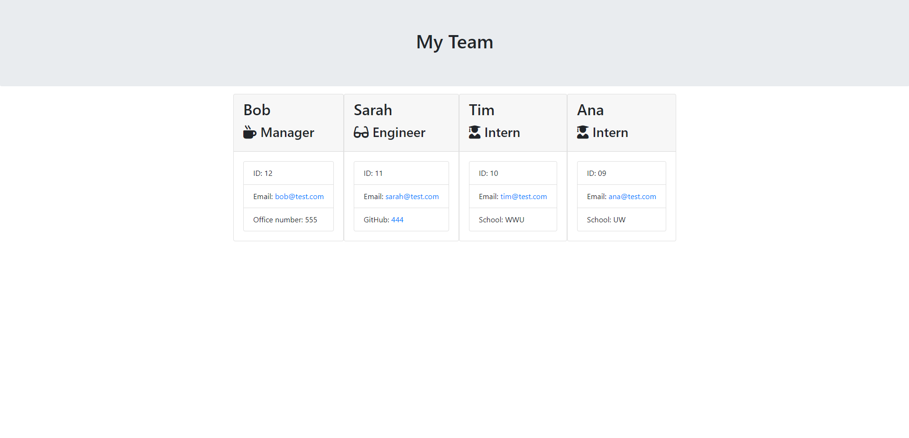
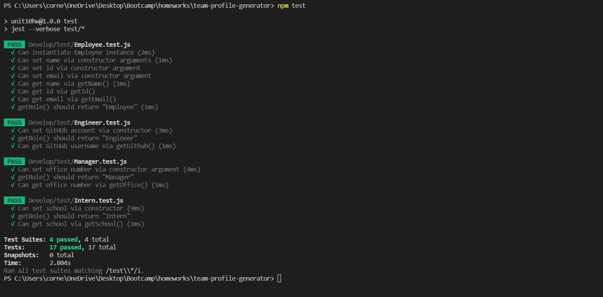

# Team Profile Generator


## Description

This command-line application takes employee information and generates a team webpage displaying the relevant information. The following Acceptance Criteria is met:

```md
GIVEN a command-line application that accepts user input
WHEN I am prompted for my team members and their information
THEN an HTML file is generated that displays a nicely formatted team roster based on user input
WHEN I click on an email address in the HTML
THEN my default email program opens and populates the TO field of the email with the address
WHEN I click on the GitHub username
THEN that GitHub profile opens in a new tab
WHEN I start the application
THEN I am prompted to enter the team manager’s name, employee ID, email address, and office number
WHEN I enter the team manager’s name, employee ID, email address, and office number
THEN I am presented with a menu with the option to add an engineer or an intern or to finish building my team
WHEN I select the engineer option
THEN I am prompted to enter the engineer’s name, ID, email, and GitHub username, and I am taken back to the menu
WHEN I select the intern option
THEN I am prompted to enter the intern’s name, ID, email, and school, and I am taken back to the menu
WHEN I decide to finish building my team
THEN I exit the application, and the HTML is generated
```

The application prompt looks as follows:


The generated webpage looks as follows:



The testing looks as follows:



The following link leads to a demonstration of the application being used:

Video of usage:

https://watch.screencastify.com/v/biPDBz2k1DZ3252MeXda

## Table of Contents

- [Installation](#installation)
- [Usage](#usage)
- [Credits](#credits)
- [Contribute](#contribute)
- [Tests](#tests)
- [Questions](#questions)
- [License](#license)

## Installation

The following packages need to be installed in order to run the application:

Inquirer: https://www.npmjs.com/package/inquirer/v/8.2.4

Jest: https://www.npmjs.com/package/jest

These packages can be installed using the command:

```md
npm i
```

## Usage

This program can be downloaded and used by anyone. To run the application, use the following node command:

```md
node index.js
```

## Credits

This following packages are credited with helping create this application:

Inquirer is used for asking the user questions: https://www.npmjs.com/package/inquirer/v/8.2.4

Jest is used for testing the application: https://www.npmjs.com/package/jest

## Contribute

This is a completed application and does not need any contributions.

## Tests

The testing for this program is run using the package "Jest" and can be run using the following command:

```md
npm test
```

## Questions

Feel free to reach out to me with questions:

Find my GitHub at: [GitHub Profile](https://github.com/cornetj13)

Email me at: cornetj2@gmail.com

## License

This source code is licensed under the MIT license found in the LICENSE file in the root directory of this source tree.